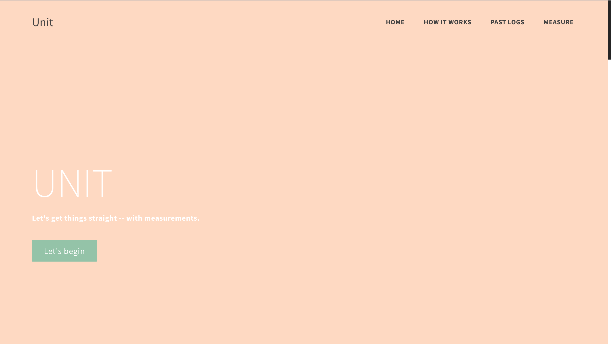
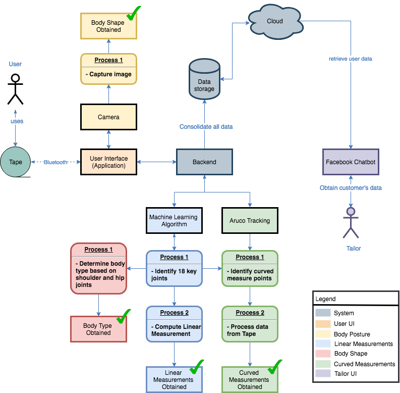

# Unit
Body measurements guidance system using computer vision and pose estimation

## Solution

The solution built is a Python Flask application that processes images of through a custom mobilenet model that is adpated from the Pose Net model. 



## Architecture



## Technologies

- Python Flask
- Tensorflow
- Anaconda (Windows)
- Bluetooth serial (Arduino BluNo)
- Html/CSS/JS

## System Requirements
- Python >= 3.6.5
- GPU (Optional)
- PIP installed

## Installation 

 1. Install Anaconda from [here](https://www.anaconda.com/download/)
    (Anaconda >= 5.3)
 2. Install Swig from here [here](http://www.swig.org/download.html)
 3. Open Anaconda prompt:
    
    Go with the mouse to the Windows Icon (lower left) and start typing "Anaconda". There should show up some matching entries. Select "Anaconda Prompt".

 4. Clone our repository and change directory:
    ```
    $ git clone https://github.com/Sri-vatsa/Unit
    $ cd Unit
    ```    
 5. Create & Activate virtual env:
    ```
    $ conda create --prefix=unit python=3.6.5
    ```
    _Note: allow conda to install all relevant packages for python 3.6.5 by typing `y` when prompted_

    List all available conda environments: (Optional)
    ```
    $ conda info --envs
    ```

    Activate conda environment for Unit:
    ```
    $ conda activate PATH/TO/ENV
    ```
    e.g. PATH/TO/ENV : `D:\Unit\unit`

 6. Install dependencies:
    ```
    $ pip install -r requirements.txt (for software dependencies)
    ```
 7. make paf for pose estimation
 8. 
